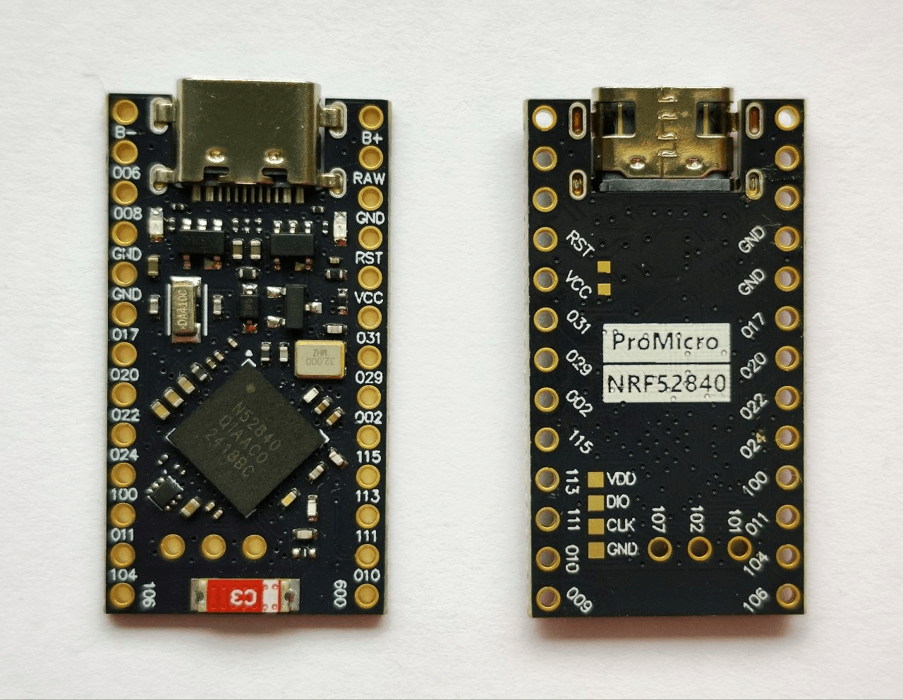

# 2.4 GHz Spectrum Analyzer for nRF52840 [Firmware]

This is the firmware for **Adafruit Feather nRF52840** (and other nRF52840 boards) that turns the device into a real-time 2.4 GHz spectrum analyzer.



It continuously scans channels from 2400 MHz to 2480 MHz and sends RSSI values over USB Serial to the Python visualization script.

## Features

- Fast scanning of 81 channels (2400–2480 MHz)
- Multiple samples per channel for better accuracy
- High baud rate (921600)
- Uses native TinyUSB CDC for stable serial communication
- Compatible with the Python spectrum analyzer (`scan.py`)

---

## Hardware Supported

- **Adafruit Feather nRF52840 Express**
- Other nRF52840 boards (may require minor adjustments)

---

## Requirements

- [PlatformIO](https://platformio.org/) (recommended)
- Or Arduino IDE with nRF52 core installed

---

## Installation (PlatformIO)

1. Create a new PlatformIO project
2. Replace `platformio.ini` and `src/main.cpp` with the files below
3. Build and upload

### `platformio.ini`

```ini
[env:adafruit_feather_nrf52840]
platform = nordicnrf52
board = adafruit_feather_nrf52840
framework = arduino
monitor_speed = 921600
build_flags = 
    -DARDUINO_USB_CDC_ON_BOOT=1
    -Os
```

---

## Usage

1. Upload the firmware to your nRF52840 board
2. Connect the board via USB
3. Run the Python script:

```bash
python scan.py --port COM1
```

(replace COM1 with your actual port, e.g. /dev/ttyACM0 on Linux/macOS)

---

## Output Format

The firmware sends data in the following format:

```text
Packet #14: 15559: 99 98 99 98 100 98 100 99 99 82 99 100 100 97 99 99 100 98 100 97 100 98 100 98 100 99 98 99 100 99 99 100 99 100 99 99 100 101 100 100 84 101 100 90 99 101 97 89 100 88 98 90 98 90 99 100 99 99 80 99 77 100 98 81 100 99 98 91 98 99 99 100 99 99 99 87 87 100 97 88 99
Packet #15: 16192: 98 98 99 99 100 99 95 100 99 100 99 99 100 100 99 100 99 100 100 98 99 100 99 100 97 99 66 101 99 100 99 101 97 99 98 99 99 100 98 100 99 100 99 101 99 99 100 99 98 101 98 99 98 100 97 99 98 88 100 99 101 99 99 99 99 100 100 89 100 91 99 100 99 99 99 99 99 99 99 96 100
Update #15 | FPS ≈ 1.6
Packet #16: 16825: 97 100 99 101 99 101 98 101 98 100 99 101 98 100 99 100 99 101 99 100 99 100 99 99 98 99 98 99 97 101 98 100 97 100 98 100 98 100 99 99 99 101 100 99 100 100 100 101 99 100 100 99 100 99 100 96 100 99 100 97 89 98 100 98 99 88 99 99 94 98 100 100 99 100 100 98 99 99 100 98 100
...
```

---

## Configuration Options
You can modify these defines in main.cpp:

| Define | Default | Description |
|---|---|---|
| CHANNEL_START | 0 | Starting channel (0 = 2400 MHz) |
| CHANNEL_END | 80 | Ending channel (80 = 2480 MHz) |
| DELAY_MS | 6 | Delay between channels (ms) |
| SAMPLES_PER_CHANNEL | 4 | Number of RSSI samples per channel |
| SPECTRUM_RADIO_MODE | 1Mbit | Radio mode (can be changed to 2Mbit) |

---

## Troubleshooting

- No COM port appears → Make sure ARDUINO_USB_CDC_ON_BOOT=1 is set
- Python script doesn't receive data → Check baud rate (must be 921600) and correct COM port
- Unstable readings → Increase SAMPLES_PER_CHANNEL or DELAY_MS
= Board not detected → Try pressing Reset button while uploading

---

## License

MIT — see [LICENSE](LICENSE.md) for details.