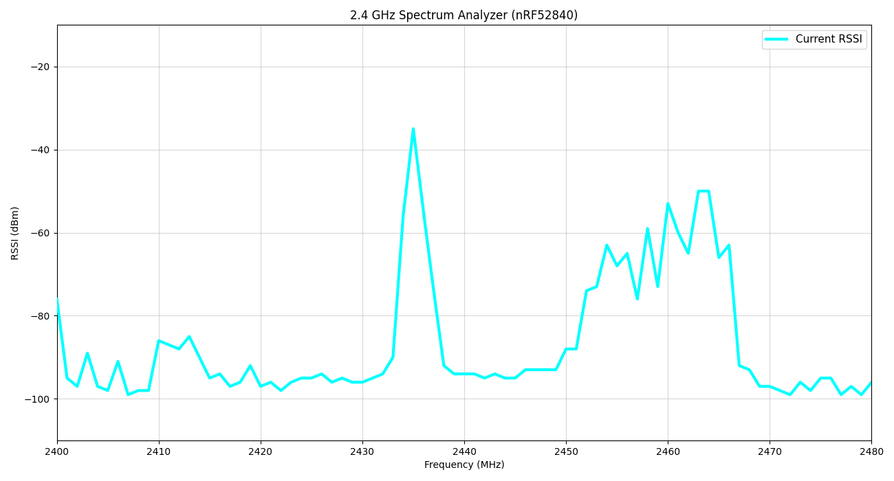

# 2.4 GHz Spectrum Analyzer for nRF52840

Real-time spectrum analyzer for the 2.4 GHz ISM band (2400–2480 MHz).  
Visualizes RSSI data received from an nRF52840-based device over a serial connection.



**Features:**
- Bright cyan line — **Current RSSI** (real-time sweep)
- Light blue line — **Peak Hold** (maximum values) — can be enabled/disabled
- Live updating with FPS counter
- Clean interactive Matplotlib interface
- Fully configurable via command-line arguments

---

## Requirements

### Software
- Python 3.8 or higher
- Required packages:
  ```bash
  pip install numpy matplotlib pyserial
  ```
  
### Hardware

- nRF52840 development board or custom device running spectrum scanning firmware
- USB-to-UART or native USB serial connection
- Device must output data in the format:
index: rssi1 rssi2 rssi3 ... (positive RSSI values, script converts them to negative dBm)

---

## Installation

1. Clone the repository:

```bash
git clone https://github.com/yourusername/nrf52840-spectrum-analyzer.git
cd nrf52840-spectrum-analyzer
```

2. Install dependencies:

```bash
pip install numpy matplotlib pyserial
```

3. (Recommended) Use a virtual environment:

```bash
python -m venv venv
# Windows
venv\Scripts\activate
# Linux / macOS
source venv/bin/activate
```

## Usage

Run the analyzer with:
```bash
python scan2.py [OPTIONS]
```
### Available Options

| Option | Default | Description |
|---|---|---|
| --port | COM1 | Serial port (e.g. COM5, /dev/ttyACM0, /dev/ttyUSB0) |
| --baud | 921600 | Baud rate |
| --channels | 81 | Number of frequency channels |
| --no-log | False | Disable detailed console logging |
| --no-peak-hold | False | Disable the Peak Hold (maximum) curve |

---

## Examples

```bash
# Run with default settings (Peak Hold enabled)
python scan2.py

# Disable Peak Hold curve
python scan2.py --no-peak-hold

# Use different COM port and disable logging
python scan2.py --port COM5 --no-log

# Linux / macOS example
python scan2.py --port /dev/ttyACM0 --baud 115200

# Custom number of channels without Peak Hold
python scan2.py --channels 101 --no-peak-hold
```

---

## How It Works

- The script connects to the specified serial port.
- It reads lines from the nRF52840 device.
- Parses RSSI values for each channel.
- Displays Current RSSI as a thick bright cyan line.
- Maintains and displays Peak Hold values (highest RSSI seen per frequency) in light blue (if enabled).
- Updates the plot in real time.


Tip: If the line doesn't appear immediately after launch, try resizing the plot window.

---

## Troubleshooting

- "Failed to connect" → Check the correct COM port / device path and that the device is plugged in.
- No data on the plot → Make sure your nRF52840 firmware sends the expected data format and includes a header line containing "2400".
- High CPU usage → The script is optimized, but you can increase plt.pause() value if needed.
- Line not visible → Resize the matplotlib window.
